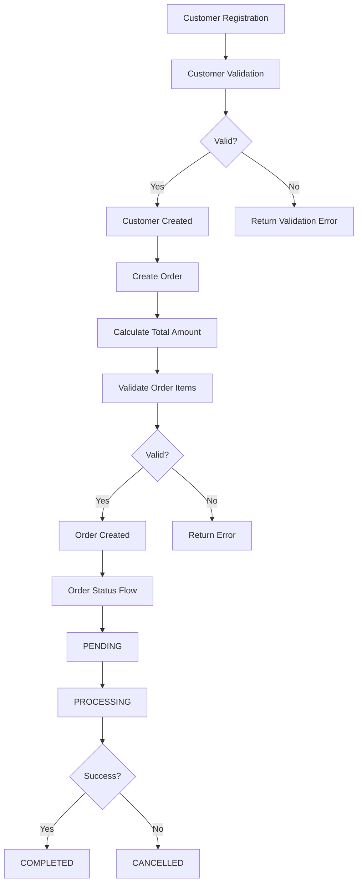

# Order Service API

A microservice for managing orders and customers, built with modern TypeScript and following best practices. This service provides a RESTful API for creating and managing orders with proper customer relationships.

## Technologies

- **Runtime & Framework:**
  - Node.js
  - Express.js
  - TypeScript

- **Database:**
  - PostgreSQL
  - Drizzle ORM
  - Zod (Schema Validation)

- **Testing:**
  - Jest
  - Supertest
  - Test Database Management

- **Development:**
  - ESLint
  - Docker & Docker Compose
  - VS Code REST Client

## Architecture

The project follows a clean architecture pattern with the following structure:

```
src/
├── controllers/        # Request handlers
│   ├── customer.controller.ts
│   └── order.controller.ts
├── db/                # Database configuration and schemas
│   ├── migrations/
│   ├── schema.ts
│   └── index.ts
├── routes/            # API routes definition
│   ├── customer.routes.ts
│   └── order.routes.ts
└── main.ts           # Application entry point
```

## Business Flow



## Getting Started

1. **Prerequisites:**
   - Node.js >= 18
   - PostgreSQL >= 14
   - Docker (optional)

2. **Environment Setup:**
   ```bash
   # Clone the repository
   git clone https://github.com/yourusername/order-service.git
   cd order-service

   # Install dependencies
   npm install

   # Setup environment variables
   cp .env.example .env
   ```

3. **Database Setup:**
   ```bash
   # Start PostgreSQL (if using Docker)
   docker-compose up -d

   # Run migrations
   npm run db:push
   ```

4. **Running the Application:**
   ```bash
   # Development mode
   npm run dev

   # Production build
   npm run build
   npm start
   ```

5. **Testing:**
   ```bash
   # Run all tests
   npm test

   # Run tests with coverage
   npm run test:coverage
   ```

## License

This project is licensed under the MIT License - see the [LICENSE](LICENSE) file for details. 